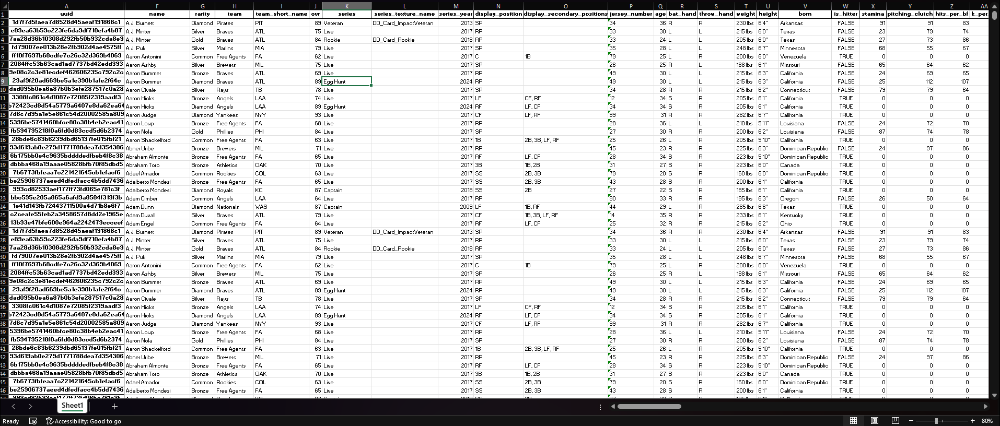

# showstats
Python script for downloading attributes and statistics for all currently available Diamond Dynasty player card items in MLB The Show '24 . 



### Install
___
Install the required dependencies if missing necessary packages:
```
~$ pip install -r requirements.txt
```


### Usage
___
Execute script using any terminal or interactive shell, & watch as data is gathered from online API.
```
~$ python3 showstats.py
```
Data will be saved to an Excel file in the user's home directory, but in the event of an error during the conversion, a pandas 'pkl' file will be created to prevent data loss..

> ./mlbtheshow_data_YYMMDD.xlsx

> /usr/home/dir/mlbtheshow_dataloss_YYMMDD.pkl 


### Contact
___

*__Created by:__*   
Colin Gallagher ~ *@colingall* ~ colingall@pm.me   
   
   
*__If you'd like to buy me a cup of coffee__*:   
https://pages.donately.com/colingall    

### License
___

MIT © Colin Gallagher

Copyright © MLB The Show '24 | Copyright © 2024 Sony Interactive Entertainment LLC.
